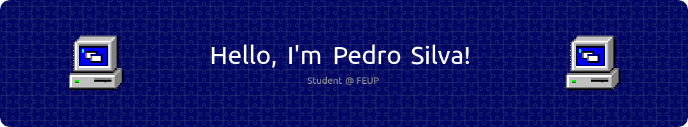

<h3 align="left">About me:</h3>

👨‍💻 I'm a third-year student of Informatics and Computer Engineering at [FEUP](https://sigarra.up.pt/feup/pt/web_page.inicial). Joined in 2020 with no prior coding experience and I have no regrets whatsoever.

🌱 I'm eager to learn and to improve my skills in anything, especially when it comes to programming.

🤖 Currently working on a discord bot written in Python related to Yu-Gi-Oh, a trading card game I like. Hopefully the first iteration will be finished this year if I don't procrastinate too much.

<h3 align="left">Some of the languages and tools I've worked with:</h3>

 
  
  
  
  
  
  
  
  
  
  

<h3 align="left">Stats:</h3>

<h3 align="left">Find me on:</h3>

  
  
  
  

<h3 align="left">And finally, a snake eating my contributions:</h3>

  
  
  

